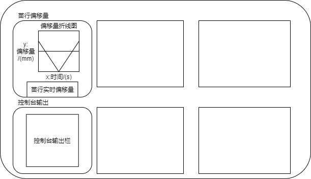

# AgriRow Vision

面向智能农机的作物行视觉感知与对行控制原型

[项目概览](#项目概览) · [系统流程](#系统流程) · [快速开始](#快速开始) · [项目结构](#项目结构) · [当前边界](#当前边界)



## 项目概览

AgriRow Vision 是一个智慧农业视觉系统原型，面向农机田间作业中的作物行识别、视角校正、横向偏移估计与设备控制。项目将相机视频处理、鸟瞰变换、目标检测、偏移曲线显示和边缘端通信整合到 PyQt5 桌面界面中，用于验证“视觉感知—状态展示—控制指令”闭环方案。

本仓库主要展示系统客户端、视觉算法原型和软硬件通信设计。项目曾以华为昇腾类边缘设备和 PLC 为目标部署环境；相关硬件服务端、专用模型权重和完整实验数据未包含在公开仓库中。

## 核心工作

- 设计相机画面到鸟瞰视角的透视变换流程，支持相机内外参与输出分辨率配置。
- 基于目标检测结果计算目标中心相对画面中心的横向偏移，并实时绘制偏移曲线。
- 实现视频文件、摄像头和远端视频流的接入原型。
- 设计指令与视频双通道客户端，支持参数同步、模型切换和 PLC 控制指令。
- 使用 PyQt5 实现监控、参数配置、日志查看和设备状态展示界面。
- 使用 Draw.io 记录系统数据流和界面设计。

## 系统流程

```text
摄像头 / 视频文件 / 边缘端视频流
                  │
                  ▼
             视频帧采集
                  │
                  ▼
        去畸变与鸟瞰视角变换
                  │
                  ▼
            目标检测与可视化
                  │
                  ▼
           作物行横向偏移估计
                  │
                  ▼
        界面显示 / 控制指令输出
```

系统模块和通信关系见 [架构说明](docs/ARCHITECTURE.md)。

## 快速开始

### 1. 环境要求

- Python 3.9–3.11
- Windows 或 Linux 桌面环境
- 摄像头（可选）
- 边缘端视觉服务与 PLC（仅联机功能需要）

> PyQt5 桌面程序在无图形界面的服务器环境中不能直接显示。

### 2. 安装

```bash
git clone https://github.com/liuyifan00565/agrirow-vision.git
cd agrirow-vision

python -m venv .venv
```

Windows：

```bash
.venv\Scripts\activate
python -m pip install --upgrade pip
python -m pip install -r requirements.txt
```

macOS / Linux：

```bash
source .venv/bin/activate
python -m pip install --upgrade pip
python -m pip install -r requirements.txt
```

### 3. 运行

启动单页系统原型：

```bash
python App.py
```

启动独立的 YOLO 检测与偏移演示：

```bash
python CropOffset.py
```

`CropOffset.py` 默认加载 `YOLO/yolov8n.pt`。该文件是通用预训练权重，用于验证检测界面和偏移计算链路，并非本项目的作物专用训练结果。

### 4. 联机配置

客户端默认通信参数保存在 `interrow_param.txt`。使用边缘设备前，请根据实际网络环境修改服务端 IP、视频端口和指令端口。未启动服务端时，界面仍可用于查看与本地视频相关的原型功能，但远端视频、参数同步和 PLC 指令不可用。

## 项目结构

```text
agrirow-vision/
├── App.py                  # 推荐入口：单页系统原型
├── CropOffset.py           # YOLO 检测与偏移曲线演示
├── YOLO/                   # YOLO 界面、示例权重
├── clientside/             # 指令、视频与消息通信
├── constant/               # 网络常量
├── design/                 # Draw.io 设计源文件与界面图
├── docs/                   # 项目说明与系统架构
├── ortho_record/           # 标定、鸟瞰变换、视频采集
├── service/                # 日志、时间与网络服务
├── ui/                     # 桌面端界面组件
├── ui2/                    # 第二版界面实验代码
├── interrow_param.txt      # 设备参数示例
└── requirements.txt        # Python 依赖
```

根目录中的 `demo_*.py`、`try2.py` 和 `mainContral-onePageui.py` 为开发过程中保留的界面或算法实验，用于呈现方案迭代，不作为推荐入口。

## 当前边界

为了使仓库内容与项目陈述一致，以下内容需要单独说明：

- 仓库未提供作物专用训练集、自训练权重、训练脚本和定量评测结果，因此目前不能仅凭此仓库复现实验精度。
- `YOLO/yolov8n.pt` 为通用预训练权重；替换为自训练模型后才能评估具体作物场景。
- 边缘设备服务端和 PLC 控制程序不在本仓库中，联机控制需配套服务。
- 部分旧版界面依赖未公开的 `res/` 资源，已保留为迭代记录；推荐从 `App.py` 启动当前单页原型。
- IP、相机参数和作物行参数均为示例值，部署前必须重新标定和配置。

项目背景、技术路线和研究价值的集中介绍见 [项目概览](docs/PROJECT_OVERVIEW.md)。

## 后续计划

- 补充数据采集、标注规则、训练配置和实验结果。
- 将相机参数、网络地址和模型路径统一迁移到配置文件。
- 拆分大型界面脚本，补充单元测试与接口测试。
- 完成昇腾端模型转换、性能测试和端到端时延评估。
- 增加离线演示数据，使项目在无硬件条件下可以完整复现。

## 作者

Yifan Liu

研究方向：计算机视觉、智慧农业与边缘智能

## 使用说明

本仓库暂未声明开源许可证。代码仅用于学习、交流和项目展示；如需复制、修改或用于其他项目，请先联系作者获得许可。
